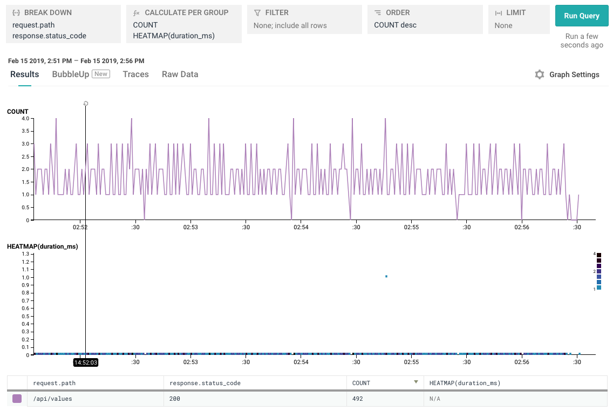

# dotnet-core-webapi

This example illustrates a barebones .NET Core web API with Honeycomb-specific middleware in order to capture a baseline of useful HTTP attributes per handled request.

We've generated a default .NET Core application built with `dotnet new webapi --no-https`,
then introduced [HoneycombMiddleware.cs](./HoneycombMiddleware.cs) to intercept HTTP requests.

The new middleware is added to the middleware stack in [Startup.cs](./Startup.cs#L33):

```csharp
app.UseMiddleware<HoneycombMiddleware>();
```

## Build and Run

Install the [.Net Core SDK](https://dotnet.microsoft.com/download). This application was built and tested with version 2.2.

Add your Honeycomb API key (available from https://ui.honeycomb.io/account) to [HoneycombMiddleware.cs](./HoneycombMiddleware.cs#L18):

```csharp
_client.DefaultRequestHeaders.Add("X-Honeycomb-Team","<WRITEKEY>");
```

And add your chosen dataset name to [HoneycombMiddleware.cs](./HoneycombMiddleware.cs#L35):

```csharp
var dataset = "<DATASET_NAME>";
```

Run the application via `dotnet run` from this directory:

```bash
$ cd dotnet-core-webapi
$ dotnet run
```

And you can query the webapi on port 5000 at `/api/values`:

```bash
$ curl http://localhost:5000/api/values
["value1","value2"]
```

## Event Fields

| **Name** | **Description** | **Example Value** |
| --- | --- | --- |
| `duration_ms`| Time spent (in milliseconds) servicing the request | `2.268` |
| `request.content_length`| Length of the content (in bytes) of the sent HTTP request | `952` |
| `request.host` | Host the request was sent to | `localhost` |
| `request.method` | HTTP method | `POST` |
| `request.path` | Path of the request | `/api/values` |
| `response.content_length`| Length of the content (in bytes) returned to the HTTP client | `168` |
| `response.status_code` | Status code written back to user | `200` |

## Example Queries


